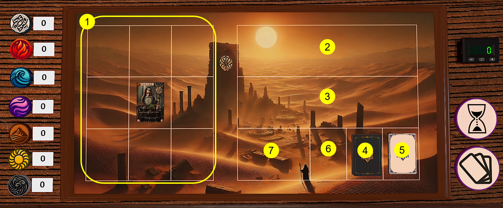

# 目录

# 游戏背景

混沌开辟之初，幻创魔法和嘈杂的意志将世界撕裂开来，轻者浮为幻之冰，沉者聚为影之渊，而在两者之间奇妙的平衡中诞生了世间万物。魔法与各式各样无形的意志、思想汇聚为了万物的精魂，而每个精魂中的法力却过于微弱，无法再改变世界。直至人类出现，原始的认知与崇拜塑造了原始的七神，火焰、水纹、地脉、大气、光辉、暗影、奥术，聚集的意志为神提供了法力，而神又将祂们的法力赐予祂们有形的使徒，巫师。直至终有一日人们发现这幻创之力本不来源于神，而是一个个平凡的灵魂。到那时，原本的秩序被打破，强权与欲望又会缔造怎样的规则。

在这个世界里，你将成为一位强大的巫师，召唤你的随从和器物为你提供力量，学习并使用法术来击败敌对的巫师。

# 基本规则

巫师牌是一个集换类对抗式卡牌游戏（TCG），玩法类似于游戏王、炉石、万智牌，但又有相当大的不同。双方玩家通过构筑自身的卡组和技能池，在游戏中召唤生物、装备道具来增长自己每回合获得的元素，再花费元素学习、使用法术击败对方玩家。当一方玩家的英雄牌生命值归零时另一方玩家获胜。

### 场地与卡组构成
双方玩家各自有一个游戏区域，包括：
1. **单位区**：放置你的英雄牌和召唤的生物牌
2. **技能区**：放置你已经学习的技能（最多5个）
3. **装备区**：放置你装备的道具（同种道具最多有1个，最多5个）
4. **主卡组**：主卡组是你抽取卡牌资源的地方，由30张生物牌和道具牌组成
5. **技能池**：技能池存放了10张你可以学习的技能，学习时直接从技能池置于场上，无需抽取
6. **弃牌堆**：弃牌堆存放你弃置的卡牌、死亡的生物和使用过的道具
7. **闲置区**：存放一些衍生卡牌和特殊卡牌

在游戏过程中，在游戏开始和每个回合开始，你将从主卡组抽牌。从手牌中召唤其中的生物，使用其中的道具来获得7种元素的费用。花费元素从技能池中学习技能，不需要抽取。其中，单位区、技能区、装备区均有区域上限，一般情况下，你的场上最多有9个单位（包括你的英雄），5个技能，5个装备。

单位区，技能区，装备区统称为战场

### 卡牌信息

### 卡牌构成
卡牌种类分为英雄牌、生物牌、道具牌、技能牌。其中，英雄牌在游戏开始时置于生物区的中央，生物牌和道具牌组成主卡组，技能牌放置于技能池中。卡牌上通常包括以下信息：

1. **属性**：表示该卡牌的属性，属性包括如下7种：

其中，奥术元素较为特殊，可以当做任意其他元素使用，需要花费奥术元素的卡牌也可以使用任意元素来代替。
2. **入场费用**：表示召唤生物、装备或使用道具、学习法术所需要花费的元素
3. **生命值**：表示单位的生命值，降为0后死亡
4. **负载**：负载表示生物牌和装备牌每回合能给你提供的元素。通过将卡牌**消耗**来获得负载的元素，被消耗的卡牌会在回合结束**重置**
5. **攻击力**：卡牌的攻击力表示当生物攻击或法术命中时造成的伤害，命令生物攻击或使用法术同样需要将其**消耗**
6. **描述文本**：描述文本记述了卡牌的效果，部分卡牌下方还记述了相关的引言与秩事
7. **使用费用**：一些卡牌在使用时同样需要支付相应的元素费用。
8. **威力**：法术牌特有，涉及到法术进攻与防御问题。

### 回合与费用

游戏按照回合制依次进行，游戏开始时双方投掷骰子决定先攻顺序。开始游戏时双方从卡组抽4张牌，双方均有一次机会将全部卡牌洗回卡组重抽4张牌，这4张牌就是玩家的起始手牌。接下来每个回合分为如下步骤：
* 回合开始：玩家从主卡组抽1张牌
* 出牌阶段：玩家的所有操作均在此阶段进行，包括召唤生物、装备或使用道具、消耗卡牌、使用卡牌效果、学习技能、使用技能等
* 回合结束：玩家弃牌直至手牌小于等于手牌上限，**重置**自己的卡牌，然后结算相应的标记

所有的生物、装备、技能在入场之后默认为**横置**状态。

# 开始一局游戏

在介绍具体规则之前，我们使用一局简单的对战来举例，来展现游戏的各种机制

# 详细规则与名词表

## 卡牌详解

巫师牌的卡牌分为四大类型：英雄，生物，技能以及道具。你可以通过卡面上的图标来区分他们。

### 英雄牌

英雄牌开局就以竖置状态出现在单位区中央，一般来说，他会拥有4负载以及6生命。一旦你的英雄生命降至0，你就输掉了本局游戏。

为了平衡先后手，先手方的第一回合，人物负载暂时只有一半。

### 生物牌

生物牌是为你提供元素的主要来源，同时，他们有着各种各样的效果。你不能直接替换生物牌。

### 技能牌

技能牌是本游戏作战的核心。主要分为两类，**法术**和**咒术**。通俗得讲，法术可以被对手防御，而咒术往往不可以。在出牌阶段，你可以直接从技能池中挑选技能，支付入场费用来讲他们加入你的技能区。技能区最多有5张技能牌，如果你想继续学习新的技能，你需要替换竖置状态的老技能。

具体的法术战斗机制将会马上更加详细地讲解。

### 道具牌

道具牌是最复杂的一类。

#### 装备

装备是道具牌中的一类，你可以打出他们并将他们装备到装备区。你会发现有的装备会有更加特殊的限制描述，比如“装备-饰物”，而有的只是“装备”。对于有限制描述的装备，每一种装备你可以同时装备一种，如果没有这个描述则不受限制。

你可以对装备进行替换，及直接打出另一张装备并将一张已经装备的竖置状态牌送去弃牌堆。

#### 消耗品

消耗品在打出并执行完效果后便会送去弃牌堆

#### 法术卷轴/咒术卷轴

这是特殊的消耗品，你可以支付费用将他们打出，效果等同于你释放相应法术（可以用于法术强化）

#### 符文

符文在使用时并不会支付费用，而是可以在合适的时机掀开，支付相应费用并且发动。（如果在对手的回合发动，则需要透支相应的费用）

## 费用

我们需要花费各种费用来使用卡牌。其中，奥术元素是一种不同的元素。

当奥术元素出现在入场费用或是使用费用中时，这意味着你可以使用任意一种元素来使用它。一个简单的例子是，巫师学徒的入场费用为1奥术元素，你可以使用比如1点火焰元素来让他入场

当奥术元素出现在负载时，当你获得该卡的负载时，你会获得一点奥术元素。奥术元素可以作为任意元素使用。比如，如果你现在有2点奥术元素，你可以打出活泼的炉火（入场费用为1火焰元素1奥术元素）

## 战斗

### 法术战斗

使用法术进行战斗是游戏的核心。

**进攻与防御**：在你释放法术进攻时，在选定目标后，对手可以选择施放法术进行防御。如果防御方至少施放了一个法术并且法术威力大于等于进攻方的威力，则防御成功，进攻方法术视为未命中，不会造成伤害以及相应效果。

**法术强化**：一个优秀的巫师应该灵活运用自己所学的法术。你可以通过消耗多个别的法术来提高自己某个法术的威力。被强化的法术威力将会得到提升，数值等同于强化法术的威力（但是攻击不会提升）。一般情况下，强化法术的效果并不会被触发。

**透支**：你可能会想到，在对手的回合，我很可能并没有相应的费用，那该如何施放法术呢？你可以通过透支机制来获得这些费用。透支就时在进行防御或者反制时，将一些卡牌横置来获取相应的费用，但是：

- 这一行为并不是消耗，无法触发相应效果
- 多余的元素不会保留，在完成反制或者防御后直接消失

比如对手施放一个1攻击3威力的法术并且使用一个2攻击5威力的法术来进行强化，你需要至少8威力的法术才能抵挡这次1攻击的进攻。假设你施放一个1攻击6威力的法术并用一个1攻击2威力的法术强化，总计需要花费5点火焰元素。你可以透支英雄牌龙卷火（4火），并透支熔火战铠（3火）来施放法术进行防御。但是，多余的2点火焰元素并不会保留，而会直接消失。

### 咒术

咒术不可防御，他们没有威力，也没有攻击。一般情况下施放后直接触发效果。

### 单位攻击

有的单位拥有攻击力。当它们处于友方的前排时，可以**消耗**他们来攻击一个法术范围内的单位（即，一般情况下不能同时获取他们的负载并且让他们攻击）。这种攻击不可被防御。

## 关键词

**入场**：在该卡牌进入战场时触发的效果。（如果可以触发效果，则必须触发）（不需要一定从手牌中打出，复活，召唤等效果一样可以触发入场）

**检索**：搜索你的卡组并抽取相应的牌，在完成后需要重新洗混卡组

**冷却**：拥有冷却标记的牌不可以被消耗或者**替换**。

**遗言**：在该卡牌离开战场，进入弃牌堆时触发的效果。（如果可以触发，则必须触发）

**穿透**：使用该卡牌攻击可以以任意单位或区域为目标。（无需考虑法术范围）

**回合技X**：每个回合，可以使用该效果X次。（你的每个回合结束时回复所有次数）

**绝技**：这张卡牌进入战场知道离开战场的时间内，可以发动一次的效果。

**速攻**：该卡牌以竖置状态进入战场。（可以立刻被消耗，使用...）

**临时**：临时的各种东西将会在你的回合结束时消失。

**献祭**：将本卡从战场上送入弃牌堆

**引魔**：本卡及所在区域在任何时刻视为处于敌方法术范围之内

**祈咒**：在玩家回合开始时执行的效果

**精通X**：每当该卡牌被消耗，叠加一层精通层数，精通层数达到X时执行特殊效果

**吞噬**：该卡牌进入战场时，必须将额外将友方战场上的卡牌送去弃牌堆。比如吞噬3生命，则需要总计至少三点生命的其他友方生物送气弃牌堆。吞噬3暗，则需要负载总计至少3暗属性元素的其他友方生物送去弃牌堆

**前排**：敌方单位区由前向后，第一个存在单位的排

**命中**：当你的攻击未被成功防御时（不一定需要造成伤害）

**法术范围**：即法术、咒术、单位攻击所能指定的目标范围，默认为所有友方单位和前排敌方单位。

**范围**：一些技能不以单位作为目标，而以区域作为目标。施放时需要指定目标区域，然后按照范围指定作用区域。指定的目标区域不应越过对手前排。如果技能命中，那么所有作用区域内的单位都受到伤害。比如：**范围：溅射**：指定主区域之后，该区域的前后左右以及主区域成为作用区域。**范围：方阵**：指定主区域之后，选择包含主区域的2x2的4个区域作为作用区域。

**异能**：异能被施放后在它的持续之间之内一直生效。比如你的持续时间为1的异能将在你的本回合结束时失效，你的持续时间为2的异能将在你的下个回合结束时失效（在对手的回合同样生效）

**反制**：某些卡只有在对手做出特定行为后才能发动

**防御**：本卡只能在法术防御时使用

**衍生**：有一些不在主要卡组以及技能卡组中的牌会与本卡产生关联

**绑定**：将某些其他卡附着在本卡上，附着的卡不占据区域或者空间，且将会随着被绑定卡牌的消失而消失

## 负面效果及标记

一般情况下，在回合结束的结算阶段，对于每种标记，移除其中的一层

**点燃**：结算阶段，移除一点点燃标记并受到1火焰伤害

**冻结**：拥有冻结标记的卡牌不能被重置

**眩晕**：拥有眩晕标记的卡牌不能由竖直进入横置

**石化**：拥有石化标记的卡牌效果视为空

**虚弱**：（作用于玩家而非卡牌）玩家法术威力下降等于虚弱层数的数值

## 结算顺序问题

首先任何结算都应当由最基本的结算（比如抽一张牌，一个生物死亡，一张卡牌入场）组成，不存在“同时发生”。比如一个范围法术一次可以击杀多个生物，那么这多个生物的死亡一定是有先后顺序的。是否需要区分其中的先后顺序在大部分情况下可能并不重要，但是在小部分情况下却有着影响。

比如如下情况：在希里的回合，希里的破晓命中了巴特尔的水栖狸猫以及海豚伙伴，那么如果是水栖狸猫先死亡，那么巴特尔可以发动海豚伙伴的效果，为水栖狸猫抵挡致命伤害，从而保护水栖狸猫不死亡。但是如果是海豚伙伴先死亡，那么巴特尔无法这么做。

我们的原则是：对于同时发生的事情，拥有该回合的玩家能够决定先后结算的顺序。在以上例子中，希里能够决定死亡的结算顺序，所以她大概率会选择先结算海豚伙伴的死亡，来让巴特尔无法发动海豚伙伴的效果。

# 卡组构筑

使用[SorceryComposer][https://yifeeeeei.github.io/SorceryComposer/] 进行卡组构筑

卡组由1英雄牌+30张主要卡组牌+10张技能卡组牌+额外卡组构成。

对于主要卡组：一种传奇级卡牌只能携带一张，同种普通卡牌最多携带两张

对于技能卡组：同种技能最多携带一张

额外卡组用于放置衍生牌。

完成构筑后，你可以导出卡组代码并在tts内直接生成相应的卡组（关闭mod cachine，来保证生成的卡牌都是最新版）

我们提供了一些预组卡组代码方便新人上手，你可以在SorceryComposer进行查看和调整

# 桌游模拟器游戏界面

请订阅我们的模组

## 生成卡组

在[SorceryComposer][https://yifeeeeei.github.io/SorceryComposer/] 上完成构筑并且复制卡组代码后，在TTS中央的输入框输入卡组代码并且点击魔法喷泉就会生成相应的卡组

将相应卡牌摆放好以后开始游戏

右下角：抽牌按钮以及全部重置按钮，会同时清空所有元素

左边的元素记录，左键增加，右键减少

常用快捷键：G合并卡牌，Q,E旋转卡牌，F翻转卡牌，ALT/OPTION放大

# 加入我们